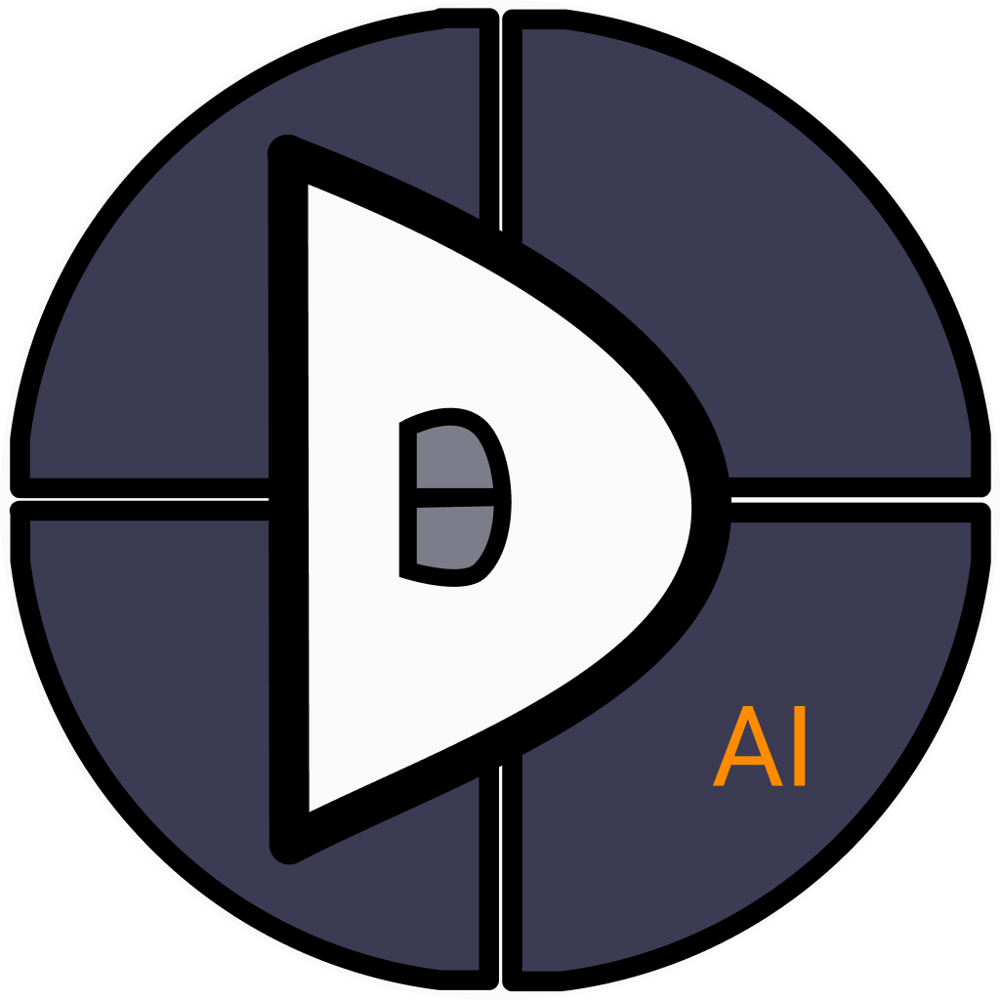
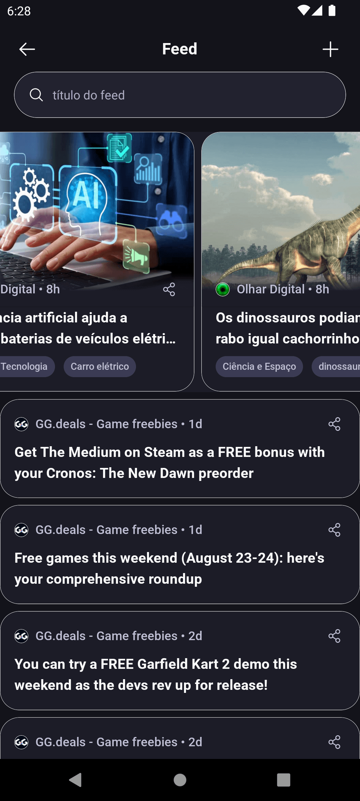
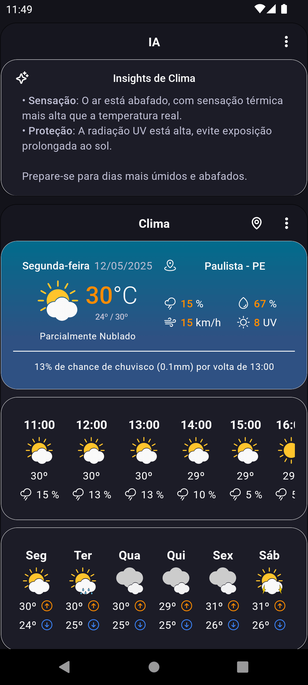
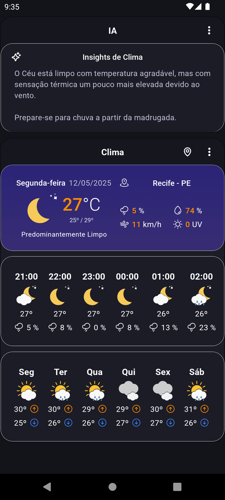
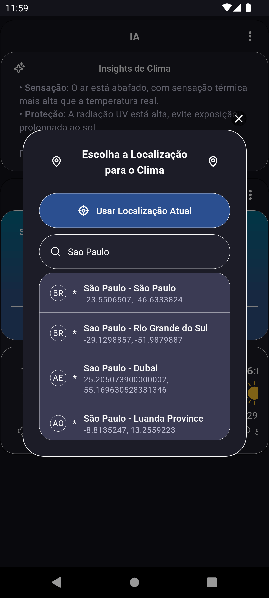
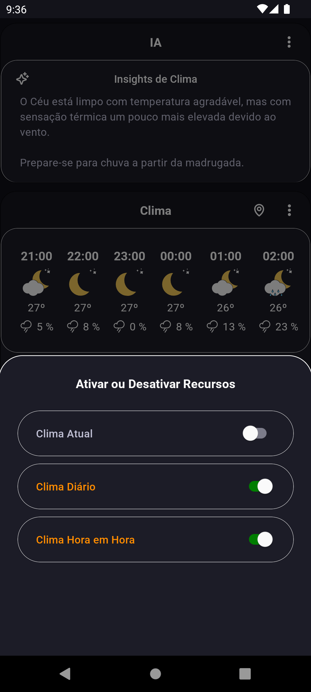

# OmniDash: Seu Dashboard Inteligente

Notícias (Feed RSS), Clima, Chat com IA, Produtividade e muito mais. Transforme dados confidenciais ou de grande volume em insights valiosos com privacidade e economia!

OmniDash é um aplicativo mobile desenvolvido com React Native e TypeScript que oferece um painel inteligente impulsionado por Inteligência Artificial generativa local. Ele se conecta a serviços de IA executados em seu PC ou servidor local, eliminando a dependência da nuvem e garantindo total privacidade dos dados enviados a ela com custo zero por tokens e personalização adaptada às suas preferências.

Ideal para entusiastas de IA, desenvolvedores ou qualquer pessoa que valorize controle sobre seus dados e experiência local de IA generativa e não quer depender de internet para tudo.

## 📸 Imagens do projeto:

<table>
  <tr>
    <td></td>
    <td></td>
    <td></td>
    <td></td>
    <td></td>
    <td></td>
  </tr>
</table>

## 📋 Roadmap

- ✅ **Privacidade total dos dados**: O app se comunica com serviços de IA locais como LM Studio, Ollama ou servidor pessoal via HTTP. 
- ✅ **Nenhum custo com tokens**: Apenas consumo de energia local.
- ✅ **UI modular e flexível**: Componentes do dashboard podem ser ativados ou desativados conforme a preferência do usuário.
- ✅ **Insights de Clima**: Obtenha insights de clima para além de simplesmente números usando sua IA local.
- ✅ **Insights do Feed**: Obtenha resumos e insights do seu Feed RSS.
- 🔜 **Chat Interativo com IA**: Converse com sua Inteligência Artificial e grave conversas de forma segura com criptografia.
- 🔜 **Análise de Imagens**: Use IA para extrair e analisar informações valiosas de imagens.
- 🔜 **Aprendizado da IA**: Construa a "memória" da sua IA para que ela te entenda e você tenha uma experiência personalizada.

Fique atento a mais recursos e ideias futuras!

## 🚀 Tecnologias:

- **[React Native](https://reactnative.dev/)** + **[Expo](https://docs.expo.dev/)**
- **[TypeScript](https://www.typescriptlang.org/)**
- **[React Native MMKV](https://github.com/mrousavy/react-native-mmkv)** (armazenamento local de alta performance) 
- **[Restyle](https://github.com/Shopify/restyle)** (design system) migração necessária de **[Styled Components](https://styled-components.com/)**
- **[TanStack Query (React Query)](https://tanstack.com/query/latest)** (dados assíncronos)
- **[EsLint](https://eslint.org/)**, **[Prettier](https://prettier.io/)** e **[Husky](https://typicode.github.io/husky/)** (qualidade de código)
- **[Jest](https://jestjs.io/)** + **[React Native Testing Library](https://github.com/callstack/react-native-testing-library)** (testes)

## 🗂️ Estrutura de Pastas:

```bash
src/
│── @types/              # Tipagem global
│── api/                 # Chamadas API
│── assets/              # Assets usados dentro to app
│── components/          # Componentes que podem ser reutilizáveis por todo o app (Text, Box, Modal)
│── features/            # Features específicas do app (ia, clima, notícias).
│── hooks/               # Hooks reutilizáveis por todo o app
│── libs/                # Configuração de bibliotecas
│── logic/               # Lógica de negócio
│── routes/              # Rotas do app
│── screens/             # Telas do app
│── services/            # Serviços e lógica externa
│── test/                # Mocks e utilitários de teste
│── themes/              # Temas e estilos globais
│── utils/               # Funções auxiliares gerais
```

## 🧠 Integração com IA local:

O app se conecta a um backend local compatível com ferramentas que rodam modelos de linguagem localmente, como:

- [LM Studio](https://lmstudio.ai/)
- [Ollama](https://ollama.com/)

A URL padrão para o backend é http://127.0.0.1:1234/api/v0 (compatível com LM Studio), mas você pode alterá-la em `./src/api/aiApi.ts` conforme sua configuração.

Após escolher um modelo de IA no seu backend, coloque o nome do modelo no arquivo `.env` usando a variável `EXPO_PUBLIC_DEFAULT_MODEL_NAME`.
> ℹ️ Verifique os termos de uso do modelo que você escolher. O uso de alguns modelos pode estar sujeito a restrições de licença ou conter censura.

Testado com modelos como Gemma, DeepSeek, Qwen e Granite. Contudo, o app não distribui modelos, sinta-se livre para escolher o modelo que preferir e sua máquina suportar.

## 🌐 Configuração das APIs:

### API de Clima:
[Open Meteo](https://open-meteo.com/en/docs) para dados meteorológicos em tempo real e previsões.

### API de Geocoding:
[Open Weather](https://openweathermap.org/api/geocoding-api) para obter endereços pelas coordenadas ou vice-versa. Requer uma chave de API, disponível gratuitamente após cadastro no site do provedor, depois insira o valor da chave na variável de ambiente `EXPO_PUBLIC_OPEN_WEATHER_MAP_API_KEY` no arquivo `.env`.

### API de IA:
Configure seu backend ou utilize um já pronto como da LM Studio. Especifique o modelo base de IA a ser utilizado na variável `EXPO_PUBLIC_DEFAULT_MODEL_NAME` no arquivo `.env`.

### API do Feed
Adicione seus links do feed (suporte a Feeds RSS 2.0) diretamente no app.

## 🧪 Experimente:

### Clone este repositório
```bash
git clone https://github.com/Tamar-J/omnidash.git
```
### Acesse a pasta do app
```bash
cd omnidash
```
### Pré-requisitos

- Certifique-se de ter criado o arquivo `.env` na raiz do projeto (.env.Sample é seu arquivo de demostração) e configurado as variáveis de ambiente: `EXPO_PUBLIC_OPEN_WEATHER_MAP_API_KEY` (obrigatório caso use o clima) e `EXPO_PUBLIC_DEFAULT_MODEL_NAME`.

- Ajuste o endereço do backend da IA em `./src/api/aiApi.ts`, se necessário.

### Instalação & Build
```bash
npm install
npx expo prebuild
```

### iOS específico: Instalar dependências CocoaPods
```bash
cd ios && pod install && cd ..
```

### Execução
```bash
npm run android         # Inicia o app no Android
npm run ios             # Inicia o app no iOS (requer macOS)
```

## 🛠️ Decisões Técnicas:

- **Princípios de Arquitetura MVVM**: Facilita a separação de responsabilidades, tornando o código mais modular e reutilizável.
- **Design System**: Utiliza Restyle para garantir consistência visual e suporte a temas. Componentes de layout como `Box` e `BoxRow` seguem referências de bibliotecas como Tamagui e Gluestack. Componentes de texto como `TextTitle` e `TextBody` seguem a hierarquia texto do Material Design 3.
- **React Query**: Solução robusta e eficiente para lidar com dados assíncronos, com excelente performance no gerenciamento de dados e persistência.
- **MMKV**: Armazenamento local eficiente e de alta performance que também pode lidar com criptografia de dados.
- **htmlparser2**: Parser de HTML rápido, aqui foi usado para transformar HTML em Markdown além de facilitar a sanitização do conteúdo vindo do Feed RSS.

## 💬 FAQ:

### Por que usar IA Local e não na nuvem?
Segurança e economia são as principais vantagens. Com seu próprio servidor, você mantém o controle total sobre seus dados e reduz os custos operacionais.

### Qual a motivação por trás do OmniDash?
Hoje, a maioria das soluções de IA depende da nuvem, o que exige internet constante, custos por tokens e abre mão da sua privacidade. O OmniDash propõe outra visão: um aplicativo mobile que conecta sua IA local, tudo sob seu controle, sem cobranças extras e com total transparência. É claro que dados como clima e notícias ainda precisam vir da internet para enriquecer os insights, mas não para executá-la. E se você precisar recorrer à nuvem para executar a IA em algum cenário especial, decide exatamente o que será compartilhado. No fim, o OmniDash entrega um painel inteligente e pessoal, pensado para facilitar sua rotina e evoluir com você com privacidade e economia.

### Preciso de um PC potente?
Para rodar modelos maiores e mais precisos localmente, é recomendado pelo menos 8GB de VRAM (placa de vídeo). Para melhor desempenho, considere placas com 16GB ou mais. Alguns modelos pode ser possível rodar usando apenas CPU. Esperamos que futuras inovações permitam o uso diretamente em smartphones intermediários ou reduza os requisitos no PC.

### O projeto está aberto para contribuição?
Por enquanto não, mas se tiver algo que queira, pode falar diretamente comigo com sua critica ou sugestão.